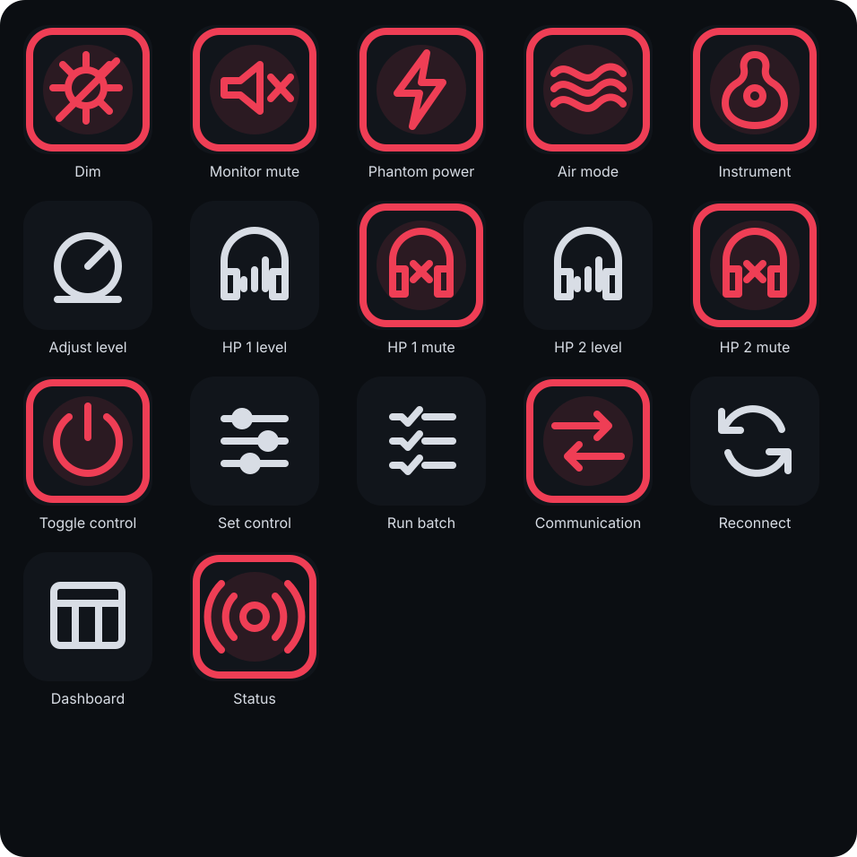

# 🎛️ Focusrite Control for Stream Deck

[](https://github.com/alexanderdalesio/focusrite-control-stream-deck/actions/workflows/ci.yml)
[](LICENSE)

An unofficial Stream Deck plugin for controlling one or more Scarlett interfaces through the [Focusrite Control API](https://github.com/alexanderdalesio/focusrite-control-2-api). Add ready-made keys for common controls or configure generic actions for anything the selected API exposes.

> [!IMPORTANT]
> Hardware testing is limited to **Focusrite Control 2 v1.1081.0.0** and a **Scarlett 16i16 4th Gen running firmware v3.0.2778.0 on macOS**. Other models, firmware, and operating systems are unverified.

This independent project is not affiliated with or endorsed by Focusrite Audio Engineering Limited or Elgato. Focusrite, Scarlett, Stream Deck, and Elgato are trademarks of their respective owners.

## Install

1. Install and configure the controller:

   ```bash
   brew install alexanderdalesio/tap/focusrite-control-api
   focusrite service install
   focusrite doctor
   ```

2. Download the latest `.streamDeckPlugin` file from [Releases](https://github.com/alexanderdalesio/focusrite-control-stream-deck/releases/latest).
3. Double-click it and approve the installation in Stream Deck.
4. Drag an action from the **Focusrite Control** category onto your device.
5. In its settings, choose **Add API**, name the connection, and enter its URL. The plugin tests the API before saving it.

Connections are saved once for the whole plugin. Every action has an **API selected** dropdown and an **Add API** button, so a profile can control several interfaces or computers without repeatedly entering URLs. Compatible input, headphone, numeric, and boolean choices are read from the selected API instead of being hard-coded.

Use `http://127.0.0.1:41780` when Stream Deck and the API run on the same computer. For a Windows Stream Deck controlling the API on a Mac, enable authenticated network access on the Mac:

```bash
focusrite network enable
```

Enter one of the displayed Mac URLs and its generated access token when adding the API on Windows. Keep the token private and allow incoming Node.js connections in the macOS firewall if prompted. Disable access with `focusrite network disable`.

Requires Stream Deck 6.6 or newer. The plugin uses Stream Deck SDK 2 and its embedded Node.js 20 runtime for compatibility with direct `.streamDeckPlugin` installation. It can run on macOS 12+ or Windows 10+, but the underlying Focusrite controller has only been hardware-tested on macOS.

## Included actions

| Action | What it does |
| --- | --- |
| Dim | Toggles monitor dim and displays its current state |
| Monitor Mute | Toggles the main monitor mute |
| Phantom Power | Toggles 48 V for any compatible input reported by the API |
| Air Mode | Toggles Air with FC2 or cycles Off, Presence, and Drive with direct USB |
| Instrument Mode | Toggles instrument mode for any compatible input |
| Headphone Level | Adjusts a selected headphone output and channel with a dial or key; direct USB only |
| Headphone Mute | Toggles mute for a selected headphone output and channel; direct USB only |
| Adjust Level | Adjusts any numeric control with a dial or one key press per step |
| Toggle Control | Toggles any named boolean control |
| Set Control | Sends a configured value to any named control |
| Run Batch | Applies up to 100 `control=value` assignments in one API request |
| Switch Communication | Switches between FC2 and direct USB |
| Reconnect | Rebuilds the active transport |
| Open Dashboard | Opens the browser control surface |
| Connection Status | Shows the selected backend and live connection state |

Live key states are refreshed every two seconds. Refresh reads are coalesced, so adding several keys does not open several connections or repeat the same state request. Actions use simple state-aware icons: red means active, orange identifies Air Drive, and muted gray means inactive. Stream Deck + dials can rotate **Adjust Level** directly; keypad users can create separate increase and decrease keys by choosing positive and negative step values.



To see the exact control names available through the selected communication method:

```bash
focusrite list
```

## Communication methods

The plugin uses whichever backend is selected in the Focusrite Control API:

- `fc2` communicates through the paired Focusrite Control 2 application. FC2 must remain open.
- `usb` communicates directly with the interface and exposes the broader control set on the tested hardware. FC2 must be closed because USB control access is exclusive.

Switch from Terminal with `focusrite backend fc2` or `focusrite backend usb`, or add the **Switch Communication** action to Stream Deck.

## Development

Node.js 24 or newer is required for the current Stream Deck SDK:

```bash
npm install
npm run check
npm run build
npm run validate
npm run pack
```

`npm run pack` creates the installable bundle in `dist/`. During development, `npm run watch` rebuilds the plugin and asks Stream Deck to reload it. The SVG action artwork is generated by `npm run icons`; the two marketplace PNGs are checked into the repository because Elgato requires that format.

Released under the [MIT License](LICENSE). Security and local-API notes are in [SECURITY.md](SECURITY.md).
